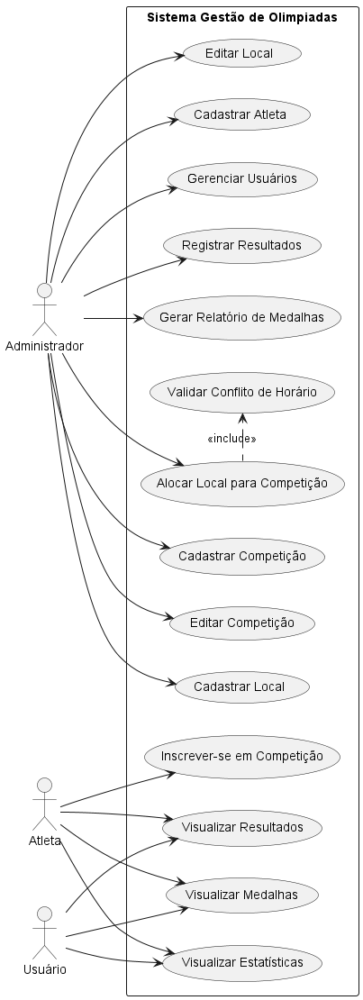
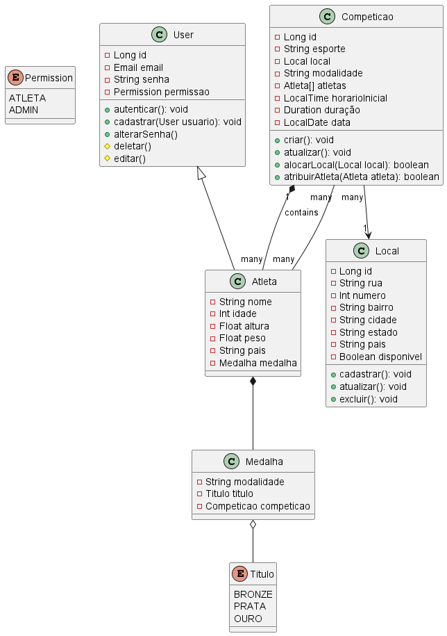
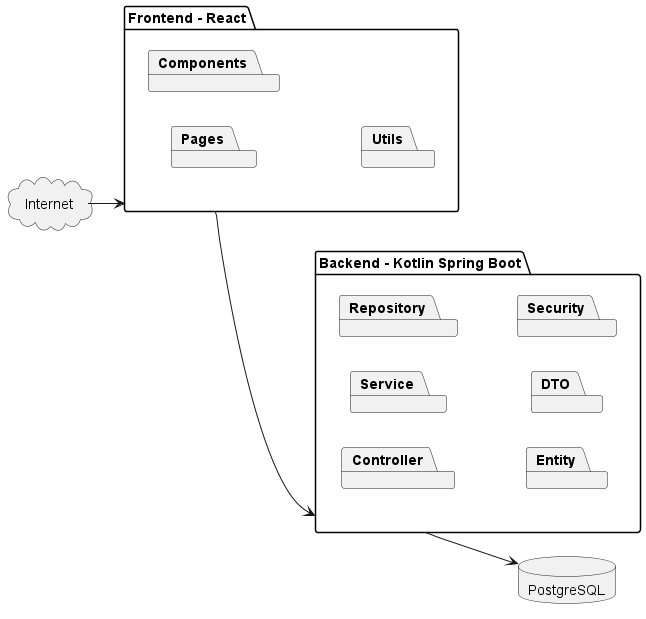
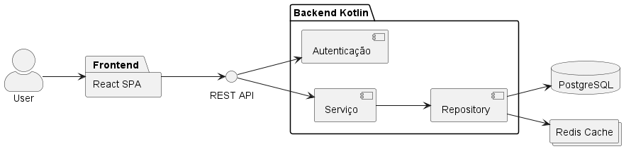
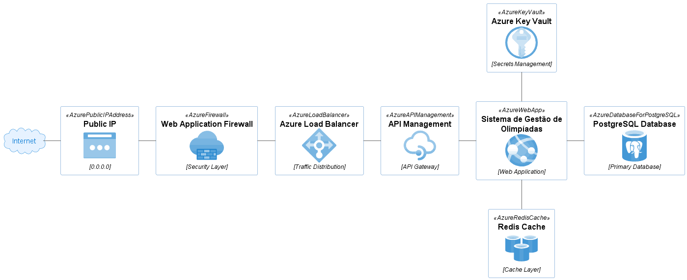

# PS-PUCMG-SGO

### Sistema de Gestão das Olimpíadas (SGO)

**Descrição do sistema:** Com a chegada das Olimpíadas, um novo sistema de gestão é
necessário para coordenar os diferentes aspectos do evento. Este sistema deve permitir o
gerenciamento de competições, inscrições de atletas, alocação de locais para as provas,
e controle de resultados.

### Regras de Negócio:

1. Cadastro de competições:

   • O sistema deve permitir o cadastro de competições, que incluem o nome da
   modalidade, data, horário, local e lista de atletas inscritos.

2. Inscrição de atletas:

   • Atletas de diferentes países devem se inscrever em competições específicas.
   Cada atleta pode participar de várias competições, mas só pode representar um
   país em cada modalidade.

3. Alocação de locais:

   • Os locais para as competições devem ser alocados de forma a evitar conflitos de
   horário. Um local só pode abrigar uma competição por vez.

4. Controle de resultados:

   • Após a realização das competições, os resultados devem ser registrados,
   determinando o atleta vencedor e os classificados em segundo e terceiro lugares.

5. Relatórios de medalhas:

   • O sistema deve gerar relatórios de medalhas, mostrando o desempenho de cada
   país com base nas medalhas de ouro, prata e bronze conquistadas.

# Documentação

## Histórias do Usuário

- US01
  Como usuário, quero me cadastrar para participar da plataforma de Gestão das Olimpíadas

- US02
  Como usuário, quero conseguir cadastrar e visualizar locais alocados de cada competição e ver a agenda do dia, semana e mês.

- US03
  Como usuário, quero conseguir visualizar e filtrar cada competição por atleta, data, horário, região.

- US04
  Como atleta, quero conseguir me cadastrar em diferentes competições representando um país.

- US05
  Como atleta, quero ser alertado de quando minha presença for confirmada em uma competição

- US06
  Como atleta, quero conseguir visualizar as estatísticas da minha performance e quantidade de medalhas obtidas.

- US07
  Como usuário, quero visualizar as estatísticas por cada competição e cada país participante

- US08
  Como usuário, quero conseguir visualizar em detalhes sobre cada jogo registrado na plataforma.

- US09
  Como atleta, quero visualizar de forma simplificada um painel contendo o cronograma e jogos disponíveis para me candidatar.

- US10
  Como usuário, quero ter a possibilidade de visualizar o cadastro dos atletas validar se estão aptos para participar nas Olimpíadas.

## Diagrama de Casos de Uso

    

## Diagrama de Classes

    

## Diagrama de Pacotes

    

## Diagrama de Componentes

    

## Diagrama de Implantação

    

